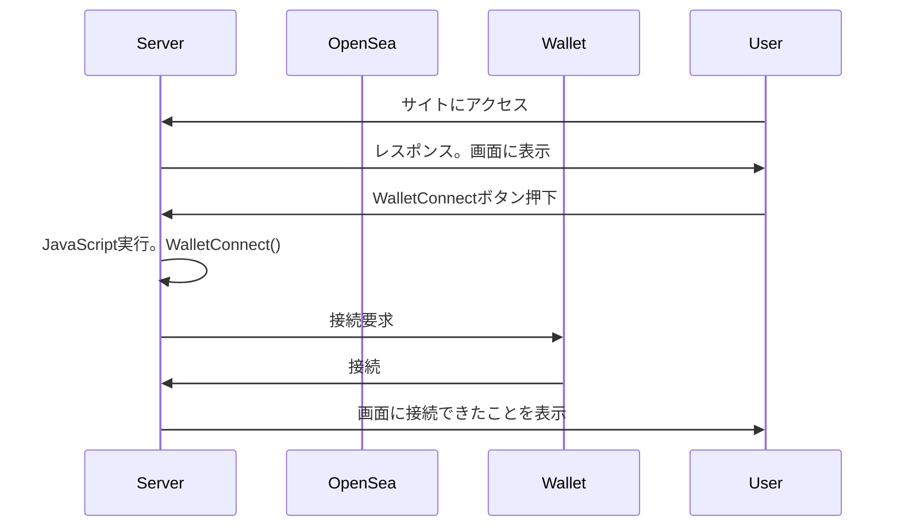
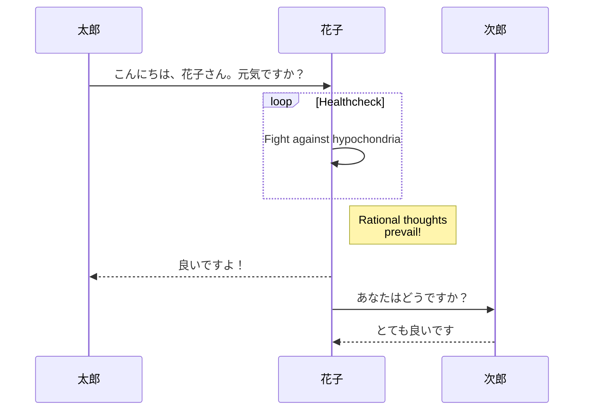

# NFTバーコードバトラー業務フロー
業務フローを考えよう

```mermaid
sequenceDiagram
    participant s as Server
    participant o as OpenSea
    participant w as Wallet
    participant u as User
    u->>s: サイトにアクセス
    s->>u: レスポンス。画面に表示
    u->>s: WalletConnectボタン押下
    s->>s: JavaScript実行。WalletConnect()
    s->>w: 接続要求
    w->>s: 接続
    s->>u: 画面に接続できたことを表示    
```

参考

```mermaid
sequenceDiagram
    太郎->>花子: こんにちは、花子さん。元気ですか？
    loop Healthcheck
        花子->>花子: Fight against hypochondria
    end
    Note right of 花子: Rational thoughts <br/>prevail!
    花子-->>太郎: 良いですよ！
    花子->>次郎: あなたはどうですか？
    次郎-->>花子: とても良いです
```
